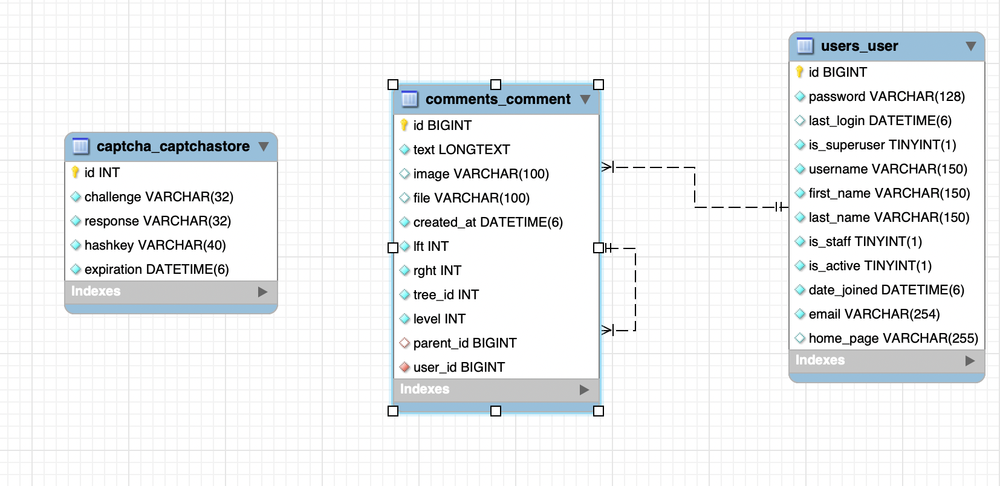

# Discourse: Full-stack Commenting System

Сучасна платформа для системи коментарів, побудована на базі **Django (DRF)** та **Vue 3**. Проект повністю контейнеризований за допомогою **Docker** і готовий до розгортання «з коробки».

## 🚀 Технологічний стек

| Складник | Технології |
| :--- | :--- |
| **Backend** | Python 3.11, Django, DRF, SimpleJWT (Auth), Captcha |
| **Frontend** | Vue 3 (Vite), Pinia (State), Axios, Nginx |
| **Infrastructure** | Docker, Docker-compose, PostgreSQL, Redis |
| **Async Tasks** | Celery + Redis (для обробки фонових задач) |

---


## 🏗 Як працює система (Архітектура)

Проєкт використовує мікросервісний підхід. Кожен сервіс ізольований, а їхня взаємодія налаштована через спільні мережі та сховища Docker.

### 🔌 Взаємодія сервісів:

1.  **Єдина точка входу (Nginx)** — Усі запити від користувача приходять на порт `80` до Nginx. Він працює як диспетчер: запити до `/api/` та `/captcha/` перенаправляються на Django, а запити до головної сторінки — на статичні файли Vue-фронтенду. Це повністю усуває помилки **CORS**.
2.  **Обробка логіки (Django)** — Бекенд на базі DRF займається валідацією даних, перевіркою капчі та керуванням JWT-токенами. Дані надійно зберігаються у базі **PostgreSQL**.
3.  **Спільне сховище (Shared Volumes)** — Це критична частина для роботи з файлами. Коли користувач завантажує картинку до коментаря, Django зберігає її у папку `/app/media/`. Завдяки налаштованим `volumes` у Docker, ця ж папка доступна контейнеру Nginx.
4.  **Швидка віддача контенту** — Коли фронтенд відображає список коментарів, Nginx самостійно бере зображення безпосередньо з диска і віддає їх клієнту. Це звільняє Django від зайвої роботи з важкими файлами.

---

## 📂 Структура проекту

```text
├── core/               # Django Backend
│   ├── core/           # Налаштування проекту (settings, wsgi, asgi)
│   ├── comments/       # Додаток для роботи з деревом коментарів
│   ├── users/          # Додаток для розширеної моделі користувача
│   ├── media/          # Динамічне сховище (зображення коментарів, капча)
│   └── Dockerfile      # Конфігурація для білду бекенду
├── frontend/           # Vue.js Frontend
│   ├── src/            # Вихідний код (components, stores, router)
│   ├── nginx.conf      # Налаштування Reverse Proxy для Docker
│   └── Dockerfile      # Конфігурація для білду фронтенду
└── docker-compose.yaml  # Оркестрація всієї системи
```

---

## 🛠 Швидкий запуск

Для запуску проекту необхідно мати встановлені **Docker** та **Docker Compose**.

1. **Клонуйте репозиторій:**
   ```bash
   git clone https://github.com/Sir-Churchill/comments-full-stack.git
   ```

2. **Налаштуйте змінні середовища:**
   Створіть файл `.env` у папці `core/` на основі прикладу `.env.sample`.

3. **Запустіть проект:**
   ```bash
   docker-compose up -d --build
   ```

Після збірки проект буде доступний за адресою: [http://localhost](http://localhost)

---

## 🔒 Особливості реалізації

* **JWT Auth:** Повна реалізація Access та Refresh токенів.
* **Captcha:** Нативна інтеграція капчі для захисту від спаму.
* **Media Handling:** Налаштована спільна папка між контейнерами для коректного відображення медіа-вкладень.
* **Secure Deletion:** Видалення коментарів доступне лише авторам або адміністраторам.

---
# comments-py
# comments-full-stack
